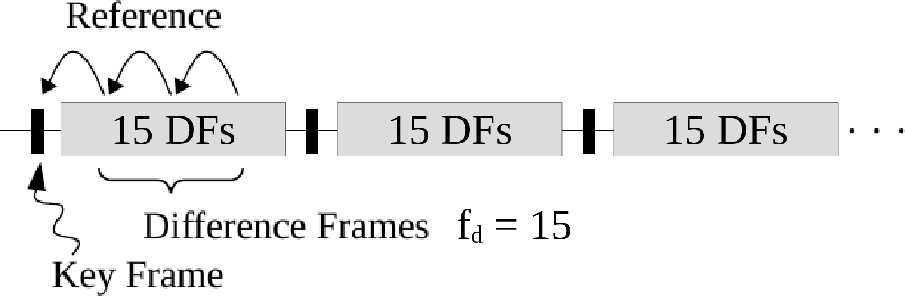

# Grid Variable Encoding

For grid data as well as temporal sequences of grids, *Lossy In-Situ Tabular Encoding for Query-Driven Analytics* (LITE-QA) employs a new compression scheme called *Grid Linearization and Tabular Encoding* (GLATE) and its temporal extension t-GLATE\ [@Lehmann2018d;@Lehmann2018a].
Both allow for efficient lossy data reduction in the spatial and temporal domain of high resolution LBM simulations of metal melt.

###### **Temporal Compression Policy**

The t-GLATE temporal compression scheme differentiates between so-called key-frames and difference-frames as shown in Fig.\ @fig:tpolicy.
While key-frames are compressed and decompressed independently using the spatial compression policy, difference-frames are compressed with a higher efficiency based on temporal differences.
The compression efficiancy is directly related to the time step size $\Delta t$ of the exported data and to the difference-frame insertion rate $f_d$, i.e.\ export of every time step, every second, every fourt.
$f_d=0$ corresponds to non-temporal compression with key-frames only.

{#fig:tpolicy}

###### **Spatial and Temporal Difference Policy**

As explained in *LITE-QA Grid Linearization*, when using the Hilbert-curve for linearization, the spatial coherence between voxels in the three dimensional simulation grids is conserved to a large extent in the neighboring data values.
For export of temporal data with high-resolution step width, neighbors in time exhibit strong temporal coherence, i.e.\ the differences between two data values of one grid cell along the temporal dimension are usally smaller than then absolute values itself.
By encoding sign flips instead of absolute signs between neighboring data values the compression rate can be further improved, as the data values are likely to share the same sign.

In key-frames, neighbors in space are defined as two consecutive data values $x^t_i$ and $x^t_{i-1}$ in one linearization $X^t$ at one time step $t$.
The difference encoding is applied to the respective step numbers $n^t_i$ on $S(n)$ for $i$ and $i-1$ according to $\Delta^X_{i}=n(x^t_i)-n(x^t_{i-1})$ as shown in Fig.\ @fig:diffpol\ (1).
In difference-frames, two neighbors in time $x_i^t$ and $x_i^{t-1}$ share the same position $i$ in two linearizations $X^t$ and $X^{t-1}$ at two time steps $t$ and $t-1$ exported consecutively.
The differences are calculated between step numbers $n^t_i$ for $t$ and $t-1$ according to $\Delta^X_{i}=n(x_i^t)-n(x_i^{t-1})$ as shown in Fig.\ @fig:diffpol\ (2).

{#fig:diffpol}

###### **Compact Grid Data Encoding**

GLATE improves the compression rate by encoding differences $\Delta^X_i$ and sign flips $s_i\neq s_{i-1}$ under certain circumstances.
Given a linearized sequence $X^t$ in key-frames or two sequences $X^t$ and $X^{t-1}$ in difference-frames, the data is transformed into four streams
$$
\begin{array}{rcl}
X_S & = & \{s_1,s_2,\ldots\}\mbox{,}\\
X_E & = & \{e_1,e_2,\ldots\}\mbox{,}\\
X_M & = & \{m_1,m_2,\ldots\}\mbox{,}\\
X_\Delta & = & \{\Delta^X_1,\Delta^X_2,\ldots\}\mbox{,}\\
\end{array}
$$
composed of signs $s_i$, exponent parts $e_i$, mantissa parts $m_i$ according to the quantization scheme, and differences $\Delta^X_i$, according to the spatial and temporal difference policy.
The streams $X_S$ and $X_\Delta$, containing signs and differences respectively, are merged into the streams $X_E$ and $X_M$, containing exponent parts and mantissa parts respectively, according to two rules, as illustrated in Fig.\ @fig:noisered:
1. Encode small differences $|\Delta^X_i|<\lfloor \omega/2\rfloor$ by updating $e_i:=0$ in $X_E$, for indication of the difference flag, and by moving the difference $\Delta^X_i$ in the mantissa part in $X_M$, updating $m_i:=q+2|\Delta^X_i|$ with $q=0$ or $1$ according the sign of $\Delta^X_i$.
2. Encode the sign flips between values, i.e.\ if a sign flip occurs $s_i\neq s_{i-1}$, then update $m_i:=m_i+\omega$ into a higher order mantissa part.

{#fig:noisered}

The first rule ensures, that sequences of differences are encoded as seuqnences of zeros in the exponent parts $X_E$, whereas small noisy numbers are moved to the mantissa parts $X_M$.
The second rule, improves the compression efficiency, because the sign flip is encoded only for a small percentage of places where it occurs.
The exponent parts $X_E$ contain the low-entropy part of the floating point data, while the mantissa parts $X_M$ contain the high-entropy part of the floating point data.
As $X_S$ and $X_\Delta$ can be reconstructed during decompression from the compressed format, only $X_E$ and $X_M$ are required and need to be compressed using the lossless compression backend, as described in the next section.
